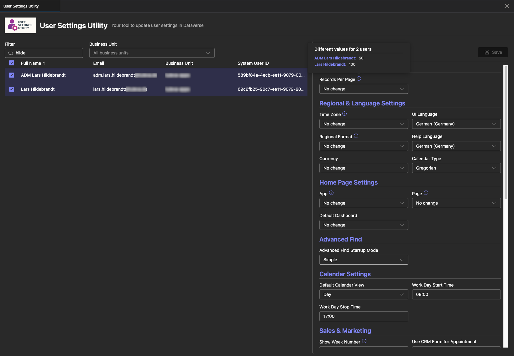

# User Settings Utility

<p align="center">
  
</p>

<p align="center">
  A Power Platform Tool Box (PPTB) plugin for viewing and updating Dynamics 365 / Dataverse user settings. This tool provides an intuitive interface to manage user settings across multiple users simultaneously.
</p>

## Screenshots

### Dark Theme



## Features

### Core Capabilities

- 👥 **User Browser** - View all active system users in your Dataverse environment
- ⚙️ **User Settings Management** - View and edit detailed user settings
- 🔄 **Bulk Updates** - Update settings for multiple users at once
- 🔍 **Advanced Filtering** - Filter users by name, email, or business unit
- 📊 **Sortable Data Grid** - Sort users by any column with multi-select support
- 💾 **Save Changes** - Track and save pending changes with visual feedback
- 🎨 **Theme Support** - Automatic light/dark theme switching based on PPTB settings

### Editable User Settings

The tool supports viewing and editing various user settings including:

- **Localization**: UI Language, Help Language, Currency, Timezone, Format (locale)
- **Navigation**: Default Homepage Area, Subarea, and Dashboard
- **Display**: Paging Limit, Calendar Type, Default Calendar View, Week Numbers
- **Regional Settings**: Date/Time formats, Number formats, Currency formats
- **Email & Sync**: Email filtering, Sync intervals, Contact sync settings
- **Advanced**: Various personalization and feature toggles

### Technical Stack

- ✅ React 18 with TypeScript
- ✅ Fluent UI React Components for consistent Microsoft design
- ✅ Vite for fast development and optimized builds
- ✅ Power Platform Toolbox API integration
- ✅ Dataverse API for querying and updating user settings

## Structure

```
pptb-user-settings-utility/
├── src/
│   ├── components/
│   │   ├── Filter.tsx                 # Business unit and text filtering
│   │   ├── Overview.tsx               # Main container component
│   │   ├── SystemuserDetails.tsx      # User details and settings editor
│   │   ├── SystemuserGrid.tsx         # Data grid for system users
│   │   └── usersettings/              # User settings components
│   │       ├── FieldInfoTooltip.tsx   # Tooltip for field info
│   │       ├── FieldRenderers.tsx     # Field rendering utilities
│   │       ├── SettingsSection.tsx    # Settings section component
│   │       ├── UsersettingsTab.tsx    # Main settings tab
│   │       └── ...                    # Additional utilities
│   ├── hooks/
│   │   └── useToolboxAPI.ts           # PPTB API hooks
│   ├── mappers/
│   │   ├── businessunitMapper.ts      # Business unit data mapping
│   │   ├── formatMapper.ts            # Format/locale data mapping
│   │   ├── languageMapper.ts          # Language data mapping
│   │   ├── sitemapMapper.ts           # Sitemap data mapping
│   │   ├── systemuserMapper.ts        # System user data mapping
│   │   ├── timezoneMapper.ts          # Timezone data mapping
│   │   └── usersettingsMapper.ts      # User settings data mapping
│   ├── services/
│   │   └── dataverseService.ts        # Dataverse API queries
│   ├── types/
│   │   ├── businessunit.ts            # Business unit type definitions
│   │   ├── currency.ts                # Currency type definitions
│   │   ├── dashboard.ts               # Dashboard type definitions
│   │   ├── format.ts                  # Format type definitions
│   │   ├── language.ts                # Language type definitions
│   │   ├── pendingChanges.ts          # Pending changes type definitions
│   │   ├── sitemap.ts                 # Sitemap type definitions
│   │   ├── systemuser.ts              # System user type definitions
│   │   ├── timezone.ts                # Timezone type definitions
│   │   └── usersettings.ts            # User settings type definitions
│   ├── App.tsx                        # Main application component
│   ├── main.tsx                       # Entry point
│   └── index.css                      # Global styling
├── dist/                              # Build output
├── icon/                              # Tool icons
├── index.html
├── package.json
├── tsconfig.json
└── vite.config.ts
```

## Installation

### Prerequisites

- Node.js >= 18.0.0
- npm or yarn
- Power Platform Toolbox installed

### Setup

1. Clone the repository:

```bash
git clone <repository-url>
cd pptb-user-settings-utility
```

2. Install dependencies:

```bash
npm install
```

## Development

### Development Server

Start development server with HMR:

```bash
npm run dev
```

The tool will be available at \`http://localhost:5173\`

### Watch Mode

Build the tool in watch mode for continuous updates:

```bash
npm run watch
```

### Production Build

Build the optimized production version:

```bash
npm run build
```

The output will be in the \`dist/\` directory.

### Preview Build

Preview the production build locally:

```bash
npm run preview
```

## Usage

### In Power Platform Toolbox

1. Build the tool:

```bash
   npm run build
```

2. Package the tool (creates npm-shrinkwrap.json):

```bash
   npm run finalize-package
```

3. Install in Power Platform Toolbox using the PPTB interface

4. Connect to a Dataverse environment

5. Launch the tool to view and manage user settings

### User Interface

#### Filter Section

- **Business Unit Dropdown**: Filter users by their business unit
- **Search Box**: Real-time search across user name, email, and business unit

#### User Grid

- Click column headers to sort
- Use checkboxes to select one or multiple users
- Columns: Full Name, Email, Business Unit, System User ID

#### Settings Panel

- View and edit settings for selected user(s)
- When multiple users are selected:
  - Fields with matching values show the common value
  - Fields with different values show "No change" placeholder
- Pending changes are tracked and displayed
- Click "Save" to apply changes to all selected users

## API Usage

The tool uses the Power Platform Toolbox and Dataverse APIs:

### Connection Management

```typescript
// Get current connection
const connection = await window.toolboxAPI.getConnection();
```

### Data Queries

```typescript
// Query system users
const users = await window.dataverseAPI.queryData(
  "systemusers?$select=systemuserid,fullname,internalemailaddress"
);

// Query user settings
const settings = await window.dataverseAPI.queryData(
  \`usersettingscollection?$filter=systemuserid eq '\${userId}'\`
);
```

### Notifications

```typescript
// Show notification
await window.toolboxAPI.utils.showNotification({
  title: "Success",
  body: "Settings updated successfully",
  type: "success",
  duration: 3000,
});
```

## License

MIT License - see [LICENSE](LICENSE) file for details.

## Author

Lars Hildebrandt
